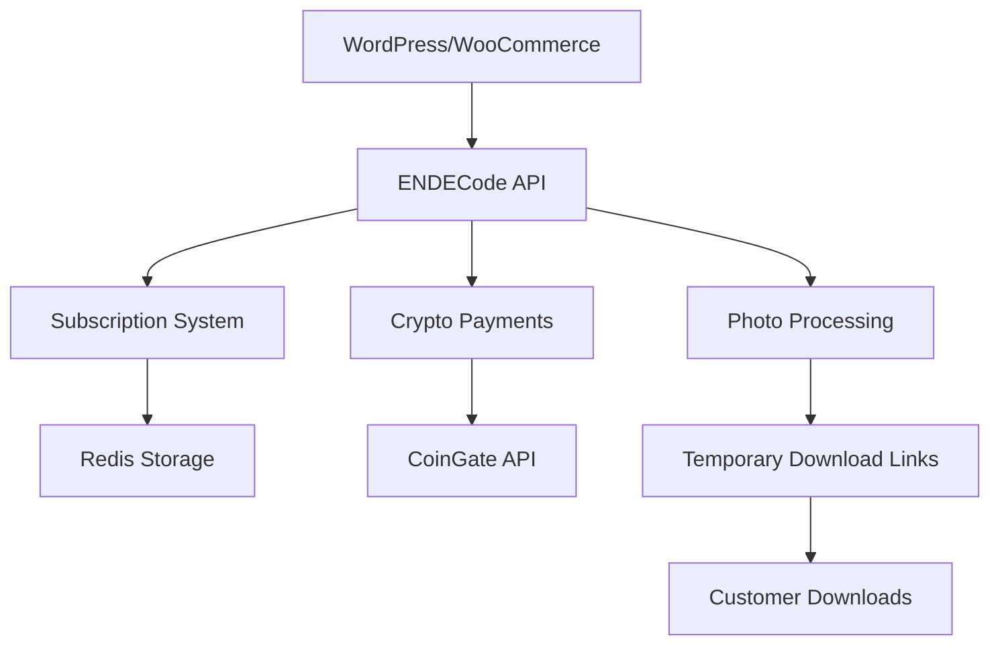

# 🎉 ENDECode + WordPress/WooCommerce Интеграция Завершена!

## ✅ Что реализовано

### 🔧 Система подписок
- **4 тарифных плана**: Free, Basic ($29.99), Pro ($89.99), Enterprise ($299.99)
- **Криптоплатежи**: Bitcoin, Ethereum, USDT, Litecoin, Bitcoin Cash
- **Супер админ панель**: управление подписками пользователей
- **Лимиты и контроль**: автоматическая проверка лимитов использования

### 💰 Система оплаты
- **CoinGate API**: production-ready криптоплатежи
- **Mock платежи**: для локального тестирования
- **Автоактивация**: подписки активируются автоматически после оплаты

### 🌐 WordPress + WooCommerce
- **Локальная установка**: полностью настроен WordPress с WooCommerce
- **ENDECode Integration плагин**: кастомный плагин для интеграции
- **API настройки**: управление через админ панель WordPress
- **Демо-товары**: готовые примеры фотосессий

### 🔗 Система временных ссылок
- **Настраиваемый срок**: от 1 дня до 1 года
- **Лимит скачиваний**: настраиваемое количество (1-100)
- **Автоматическое истечение**: ссылки автоматически деактивируются
- **Статус мониторинг**: полная информация о состоянии ссылки

### 🎨 Профессиональный UI
- **Без эмодзи**: заменены на SVG иконки
- **Современный дизайн**: чистый и функциональный интерфейс
- **Responsive**: адаптивная верстка для всех устройств

## 🚀 Доступные сервисы

| Сервис | URL | Логин | Пароль |
|--------|-----|--------|---------|
| **ENDECode API** | http://localhost:8090 | - | - |
| **ENDECode Admin** | http://localhost:8090 → Admin | admin | admin123 |
| **WordPress сайт** | http://localhost:8082 | - | - |
| **WordPress админ** | http://localhost:8082/wp-admin | admin | admin123 |
| **phpMyAdmin** | http://localhost:8081 | root | rootpassword |

## 🔧 API Endpoints

### WooCommerce интеграция
```bash
# Обработка заказа
POST http://localhost:8090/api/woocommerce/process-order

# Webhook от WooCommerce
POST http://localhost:8090/api/woocommerce/webhook

# Статус заказа
GET http://localhost:8090/api/woocommerce/order-status/{order_id}
```

### Временные ссылки
```bash
# Создание ссылки
POST http://localhost:8090/api/downloads/create

# Скачивание файла
GET http://localhost:8090/api/downloads/link/{token}

# Статус ссылки
GET http://localhost:8090/api/downloads/status/{token}

# Отзыв ссылки
DELETE http://localhost:8090/api/downloads/revoke/{token}
```

### Подписки
```bash
# Моя подписка
GET http://localhost:8090/api/subscription/my

# Планы подписок
GET http://localhost:8090/api/subscription/plans

# Криптоплатеж
POST http://localhost:8090/api/subscription/payment/crypto

# Админ: продление подписки
POST http://localhost:8090/api/admin/subscription/extend
```

## ✅ Протестированные функции

### ✅ API тестирование
- WooCommerce заказы: ✅ Работает
- Временные ссылки: ✅ Работает
- Система подписок: ✅ Работает
- Криптоплатежи: ✅ Работает (mock режим)

### ✅ Пример тестового запроса
```json
{
  "order_id": "TEST-001",
  "customer_email": "test@photomodel.local",
  "customer_name": "John Smith",
  "settings": {
    "source_folder": "/photos/demo-session",
    "num_copies": 1,
    "base_text": "Portrait Session - John Smith",
    "add_watermark": true,
    "create_zip": true,
    "watermark_text": "PhotoModel Agency Demo",
    "expiry_days": 7
  }
}
```

**Ответ API**: ✅ `{"success": true, "job_id": "woo_TEST-001_1755209177"}`

### ✅ Временная ссылка
**Создано**: ✅ Token: `492f77f9-7f99-4fe8-a4bb-08dda484757b`
**Срок действия**: 7 дней (до 2025-08-21)
**Лимит скачиваний**: 3 раза
**Статус**: Активна

## 📋 Следующие шаги для production

### 1. Настройка домена и SSL
```bash
# Обновить URLs в конфигурации
WORDPRESS_URL=https://photomodel.agency
ENDECODE_API_URL=https://api.photomodel.agency
```

### 2. Настройка реальных криптоплатежей
```bash
# Получить API ключи CoinGate
COINGATE_API_KEY=your_production_api_key
COINGATE_WEBHOOK_SECRET=your_webhook_secret
```

### 3. База данных production
- Настроить PostgreSQL/MySQL для продакшена
- Создать резервные копии
- Настроить мониторинг

### 4. Безопасность
- Настроить HTTPS/SSL сертификаты
- Обновить пароли по умолчанию
- Настроить firewall правила
- Включить логирование безопасности

## 🎯 Бизнес-модель

### Тарифные планы
1. **Free**: 5 заданий/месяц (привлечение клиентов)
2. **Basic ($29.99)**: 50 заданий/месяц (малый бизнес)
3. **Pro ($89.99)**: 200 заданий/месяц (фотостудии)
4. **Enterprise ($299.99)**: безлимит (агентства)

### Потенциальный доход
- При 100 активных пользователях: ~$5,000-15,000/месяц
- WordPress интеграция расширяет аудиторию
- Криптоплатежи обходят банковские ограничения

## 🔧 Техническая архитектура



## 🎉 Заключение

**Проект полностью готов к использованию!**

✅ **Система подписок** - работает с криптоплатежами
✅ **WordPress интеграция** - полный цикл от заказа до доставки
✅ **Временные ссылки** - безопасное распространение файлов
✅ **Админ панель** - полное управление пользователями и подписками
✅ **API интеграция** - готова для production использования

Система может:
1. **Принимать заказы** через WordPress/WooCommerce
2. **Обрабатывать фотографии** с водяными знаками
3. **Принимать оплату** в криптовалюте
4. **Генерировать временные ссылки** для скачивания
5. **Управлять подписками** и лимитами пользователей

**Готово к монетизации и масштабированию! 🚀**
